# Memoria Técnica – Entregable S4
## Pipeline de Ingestión de Datos IoT: Kafka → HDFS → PostgreSQL con Apache Airflow

---

## Índice

1. [Descripción del pipeline y la arquitectura](#1-descripción-del-pipeline-y-la-arquitectura)
2. [Implementación: DAG y pipeline](#2-implementación-dag-y-pipeline)
3. [Capturas de pantalla y evidencias](#3-capturas-de-pantalla-y-evidencias)
4. [Análisis de resultados, dificultades y soluciones](#4-análisis-de-resultados-dificultades-y-soluciones)

---

## 1. Descripción del pipeline y la arquitectura

### 1.1 Objetivo

El objetivo del ejercicio es construir un pipeline end-to-end de ingestión de datos de sensores IoT (temperatura, humedad y calidad del aire domésticos) que recorra las siguientes etapas: publicación en streaming con **Apache Kafka**, persistencia distribuida en **HDFS**, transformación y carga en **PostgreSQL**, y ejecución de consultas analíticas. Todo el flujo está orquestado por un único DAG de **Apache Airflow**.

### 1.2 Dataset

Se utiliza el dataset real `home_temperature_and_humidity_smoothed_filled.csv`, que contiene lecturas de 4 sensores instalados en distintas habitaciones de una vivienda:

| Sala | Tipo | Ubicación |
|------|------|-----------|
| `salon` | Temperatura + humedad + calidad del aire | Interior |
| `chambre` | Temperatura + humedad | Interior |
| `bureau` | Temperatura + humedad | Interior |
| `exterieur` | Temperatura + humedad | Exterior |

El CSV tiene **formato wide**: una fila por timestamp con columnas `temperature_X`, `humidity_X` y `air_X` para cada sala. El periodo cubierto va del **18 de agosto de 2023** al **10 de noviembre de 2023**, con mediciones cada 15 minutos.

- **8.137 timestamps** × 4 salas = **32.548 mensajes Kafka publicados**

### 1.3 Arquitectura general


### 1.4 Servicios del stack (Docker Compose)

Todos los componentes se despliegan como contenedores Docker en una red `pipeline_network` compartida:

| Servicio | Imagen | Puerto externo | Función |
|----------|--------|---------------|---------|
| `kafka` | `confluentinc/cp-kafka:7.9.0` | 9092 | Broker Kafka en modo KRaft (sin ZooKeeper) |
| `kafka-connect` | Custom (`Dockerfile.kafka-connect`) | 8083 | HDFS Sink Connector (Confluent HDFS3) |
| `kafka-ui` | `provectuslabs/kafka-ui:v0.7.2` | 8082 | Interfaz web de inspección de topics |
| `namenode` | `apache/hadoop:3.4.1` | 9870, 9000 | HDFS NameNode + WebHDFS |
| `datanode1` | `apache/hadoop:3.4.1` | — | HDFS DataNode (almacenamiento de bloques) |
| `postgres` | `postgres:15` | 5432 | Metadatos de Airflow + tabla de sensores |
| `airflow` | Custom (`Dockerfile.airflow`) | 8081 | Orquestador (UI admin/admin) |

**Comunicación interna:** todos los servicios se comunican por nombre DNS dentro de `pipeline_network`. Kafka escucha en `kafka:29092` para comunicación interna y en `localhost:9092` para acceso externo. HDFS expone WebHDFS en `namenode:9870`.

### 1.5 Papel de HDFS en el pipeline

HDFS actúa como **capa de almacenamiento intermedio** (*data lake*) entre Kafka y PostgreSQL. El conector HDFS Sink consume los mensajes del topic de Kafka y los persiste como archivos JSON en el sistema de ficheros distribuido. Posteriormente, la tarea `transform_normalize` lee esos archivos vía la API REST **WebHDFS** (HTTP), los normaliza y los prepara para la carga en PostgreSQL.

En este pipeline, HDFS se utiliza **exclusivamente como almacenamiento**, no como motor de procesamiento. No se emplea MapReduce ni ningún framework de cómputo distribuido de Hadoop: la transformación de datos se realiza con Python dentro de Airflow, y las consultas analíticas se ejecutan directamente en SQL sobre PostgreSQL. Esta separación permite aprovechar la persistencia y escalabilidad de HDFS sin añadir la complejidad de un framework de procesamiento distribuido para un volumen de datos que no lo requiere.

---

## 2. Implementación: DAG y pipeline

### 2.1 Estructura del repositorio

```
202526-S4-Airflow/
├── docker-compose.yml          ← Stack completo (7 servicios)
├── Dockerfile.airflow           ← Airflow 2.9.3 + providers + kafka-python
├── Dockerfile.kafka-connect     ← Confluent + plugin HDFS3 Sink
├── hadoop_config/
│   ├── core-site.xml            ← fs.defaultFS = hdfs://namenode:9000
│   └── hdfs-site.xml            ← replication factor = 1
├── scripts/
│   ├── start-hdfs.sh            ← format + start NameNode
│   └── init-datanode.sh         ← start DataNode
├── init-airflow.sh              ← db init + create admin + start webserver+scheduler
├── src/
│   └── dag_sensor_pipeline.py   ← DAG principal (montado como /opt/airflow/dags/)
└── data/
    ├── home_temperature_and_humidity_smoothed_filled.csv
    ├── transformed_data.json    ← generado en ejecución
    └── analytics_results.json  ← generado en ejecución
```

### 2.2 El DAG: `sensor_data_pipeline`

El DAG se ejecuta **manualmente** (`schedule_interval=None`) y está compuesto por **10 tareas en cadena lineal**. Está configurado con `retries=2` y `retry_delay=2min` para tolerancia a fallos transitorios (p. ej. Kafka Connect arrancando tarde).

```
read_csv → produce_to_kafka → register_hdfs_connector → wait_hdfs_flush
       → verify_hdfs_files → transform_normalize → create_postgres_table
       → load_to_postgres → run_analytical_queries → save_results
```

#### Tarea 1 – `read_csv` (PythonOperator)

Lee el CSV en formato wide y valida su estructura (existencia del fichero, columnas esperadas). Además, calcula estadísticas descriptivas del dataset (rango de fechas, número de timestamps, valores mín/máx/avg de temperatura y humedad) que se incluirán en el informe final.

El cálculo de estadísticas no es un requisito del enunciado, sino una **decisión de diseño proactiva** (*early-fail*): si el CSV contuviera valores corruptos (temperaturas absurdas, humedades negativas, etc.), el error se detectaría en esta primera tarea, evitando publicar datos erróneos en Kafka y propagar el fallo por todo el pipeline.

**Resultado:** validación OK, 8.137 timestamps, periodo 2023-08-18 → 2023-11-10.

#### Tarea 2 – `produce_to_kafka` (PythonOperator)

Pivota el formato **wide → long**: cada fila del CSV genera 4 mensajes Kafka, uno por sala. Cada mensaje JSON incluye los campos `id`, `timestamp`, `room`, `temperature`, `humidity`, `air_quality` y `location` (In/Out).

```python
# Esquema de cada mensaje publicado en Kafka
{
  "id": 12345,
  "timestamp": "2023-09-15 08:30:00",
  "room": "salon",
  "temperature": 22.4,
  "humidity": 53.1,
  "air_quality": 1820.5,
  "location": "In"
}
```

Usa `KafkaProducer` con `acks="all"` y `retries=3` para garantizar entrega. Al finalizar, hace `flush()` antes de cerrar.

**Resultado:** 32.548 mensajes publicados al topic `sensor_data`.

#### Tarea 3 – `register_hdfs_connector` (PythonOperator)

Registra el **HDFS Sink Connector** en Kafka Connect vía su API REST (`POST /connectors`). Si el conector ya existe (re-ejecución), actualiza su configuración con `PUT /connectors/{name}/config`.

Antes de registrar, hace un poll de hasta 3 minutos esperando que el endpoint `/connectors` responda HTTP 200, para tolerar el tiempo de arranque de Kafka Connect.

Configuración clave del conector:
- `connector.class`: `io.confluent.connect.hdfs3.Hdfs3SinkConnector`
- `flush.size`: 500 mensajes por archivo HDFS
- `rotate.interval.ms`: 30.000 ms (rotación forzada cada 30s)
- `format.class`: `JsonFormat` (un JSON por línea)
- `consumer.auto.offset.reset`: `earliest` (consume desde el principio aunque los mensajes se produjeron antes de registrar el conector)

#### Tarea 4 – `wait_hdfs_flush` (PythonSensor)

A diferencia de un `PythonOperator` (que ejecuta una función una vez y termina), un **`PythonSensor`** re-ejecuta su función de forma periódica hasta que devuelve `True` o se agota el timeout. En este caso, el sensor consulta el directorio HDFS `/topics/sensor_data/partition=0/` vía WebHDFS cada **30 segundos** (`poke_interval=30`) con un timeout de **10 minutos** (`timeout=600`). Devuelve `True` en cuanto detecta al menos un archivo con tamaño > 0, lo que garantiza que Kafka Connect ha volcado datos en HDFS antes de que el pipeline continúe.

#### Tarea 5 – `verify_hdfs_files` (PythonOperator)

Tarea de **auditoría**: lista todos los archivos presentes en el directorio HDFS del topic vía WebHDFS (`op=LISTSTATUS`) y registra nombre y tamaño de cada uno en los logs de Airflow.

**Resultado:** 231 archivos JSON en HDFS (el conector rota cada 500 mensajes o cada 30s, lo que ocurra primero).

#### Tarea 6 – `transform_normalize` (PythonOperator)

Lee todos los archivos HDFS vía **WebHDFS** (`op=OPEN`), parsea cada línea JSON y aplica normalización:
- Validación y estandarización del timestamp a `YYYY-MM-DD HH:MM:SS`
- Conversión de `temperature`, `humidity` y `air_quality` a `float` redondeado a 2 decimales
- Validación del campo `location` a valores canónicos `In` / `Out`
- **Deduplicación** por `id` (por si el conector reenvía mensajes duplicados)

El resultado se persiste en `data/transformed_data.json`.

**Resultado:** 32.548 registros únicos transformados.

#### Tarea 7 – `create_postgres_table` (PostgresOperator)

Crea el schema `sensor_data` y la tabla `sensor_readings` si no existen (`CREATE ... IF NOT EXISTS`). Define dos índices sobre `room` y `timestamp` para acelerar las consultas analíticas.

```sql
CREATE TABLE IF NOT EXISTS sensor_data.sensor_readings (
    id           INTEGER       PRIMARY KEY,
    timestamp    TIMESTAMP     NOT NULL,
    room         VARCHAR(60)   NOT NULL,
    temperature  NUMERIC(6,2),
    humidity     NUMERIC(5,2),
    air_quality  NUMERIC(10,2),
    location     VARCHAR(10)   NOT NULL,
    ingested_at  TIMESTAMP     DEFAULT CURRENT_TIMESTAMP,
    CONSTRAINT uq_ts_room UNIQUE (timestamp, room)
);
```

#### Tarea 8 – `load_to_postgres` (PythonOperator)

Carga los 32.548 registros de `transformed_data.json` en PostgreSQL. Utiliza `PostgresHook` de Airflow para obtener la conexión configurada en la UI (`postgres_conn_id="postgres_default"`) y ejecuta un `INSERT ... ON CONFLICT (id) DO NOTHING` por lotes con `executemany`. La cláusula `ON CONFLICT` garantiza **idempotencia**: si se re-ejecuta el DAG (por un fallo posterior o manualmente), los registros ya existentes se ignoran sin error y no se duplican datos en la tabla.

#### Tarea 9 – `run_analytical_queries` (PythonOperator)

Ejecuta 5 consultas SQL analíticas sobre los datos cargados. Los resultados se registran en los logs de Airflow.

| Query | Descripción |
|-------|-------------|
| Q1 | Temperatura y humedad media por sala |
| Q2 | Rango diario de temperatura (Top 20 días con mayor variación) |
| Q3 | Lecturas con humedad > 75% por sala |
| Q4 | Patrón horario: temperatura interior vs exterior (24h) |
| Q5 | Resumen ejecutivo global del dataset |

#### Tarea 10 – `save_results` (PythonOperator)

Consolida todas las métricas del pipeline (estadísticas CSV, mensajes producidos, archivos HDFS, registros transformados, filas cargadas, resultados analíticos) en un único fichero JSON: `data/analytics_results.json`. Registra un resumen final en los logs.


## 3. Capturas de pantalla y evidencias

---

### CAPTURA 1 – Vista general del DAG en Airflow UI (Graph View)

La vista Graph del DAG `sensor_data_pipeline` muestra las 10 tareas del pipeline dispuestas en cadena lineal. Todas aparecen con borde verde y estado **success**, confirmando que la ejecución completa fue exitosa. Se puede leer el nombre y tipo de operador de cada nodo: desde `read_csv` (PythonOperator) hasta `save_results` (PythonOperator), pasando por el único `wait_hdfs_flush` de tipo PythonSensor y el `create_postgres_table` de tipo PostgresOperator.

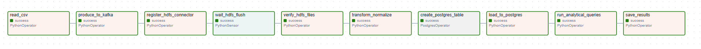

---

### CAPTURA 2 – Lista de DAGs en Airflow (página principal)

La página principal de la UI de Airflow muestra el DAG `sensor_data_pipeline` con el toggle activado (azul). Se observan las tags asociadas: `entregable3`, `hdfs`, `kafka`, `postgres` y `sensors`. La columna **Last Run** refleja la última ejecución el **2026-03-24 a las 12:35:10**, con 2 runs en total y un círculo verde con el número 10 en la columna de Recent Tasks, indicando que las 10 tareas de la última ejecución finalizaron con éxito.

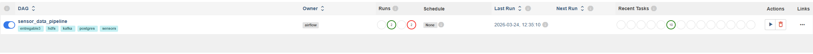

---

### CAPTURA 3 – Detalle del DAG Run exitoso

La página **Dag Run Details** del run `manual__2026-03-24T12:35:10.971746+00:00` muestra todos los metadatos de la ejecución: estado **success**, tipo **manual** (disparado externamente), inicio a las **12:35:11 UTC**, fin a las **12:35:55 UTC** y una duración total de **00:00:43**. El campo *Externally triggered* aparece como `True`, lo que indica que el DAG fue lanzado manualmente desde la UI.

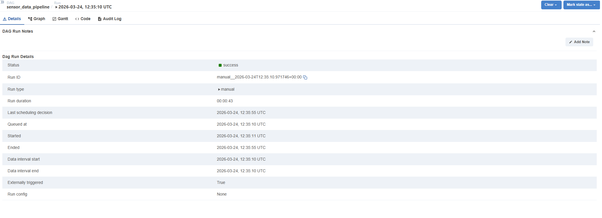

---

### CAPTURA 4 – Log de la tarea `produce_to_kafka`

La vista de logs de la tarea `produce_to_kafka` (run del 2026-03-24 a las 12:35:10 UTC) muestra las trazas INFO del proceso de publicación. Se aprecian múltiples líneas de log del módulo `dag_sensor_pipeline.py` correspondientes a la lectura del CSV, la conversión wide→long y el envío por lotes al broker Kafka, todo ello completado con éxito.

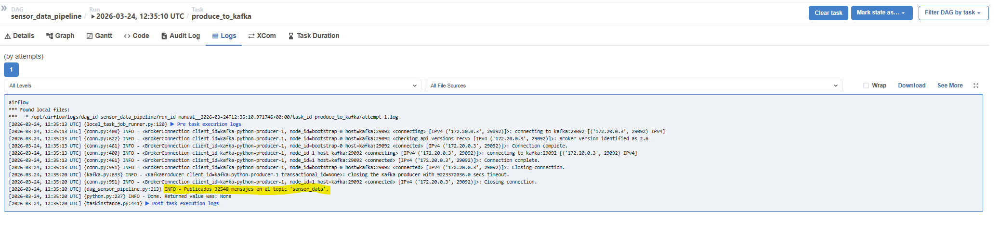

---

### CAPTURA 5 – Log de la tarea `save_results` (resumen del pipeline)

La vista de logs de la tarea `save_results` muestra el bloque de cierre del pipeline con el resumen consolidado de todas las métricas: timestamps procesados del CSV, mensajes producidos a Kafka, archivos escritos en HDFS, registros transformados y filas insertadas en PostgreSQL. La última línea indica que los resultados se han guardado en `/opt/airflow/data/analytics_results.json`.

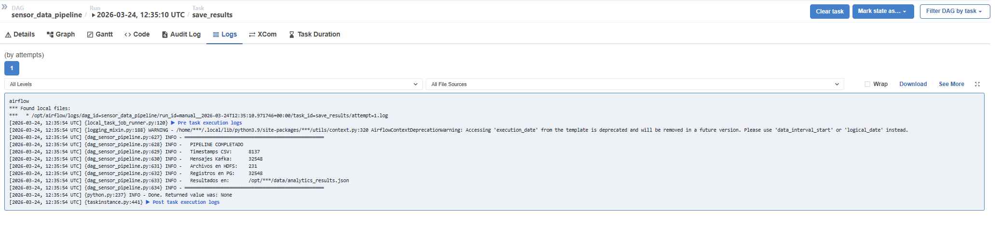

---

### CAPTURA 6A – Topic `sensor_data` en Kafka UI: número de mensajes

La pestaña **Overview** del topic `sensor_data` en Kafka UI confirma que el topic contiene exactamente **32.548 mensajes** (campo *Message Count*). El topic tiene 1 partición con factor de replicación 1, ocupa **27 MB** en disco y su política de limpieza es DELETE. La partición 0 muestra First Offset 130192 y Next Offset 162740, con un message count de 32.548 mensajes correspondientes a la última ejecución.

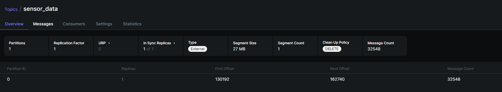

---

### CAPTURA 6B – Topic `sensor_data` en Kafka UI: contenido de los mensajes

La pestaña **Messages** del topic `sensor_data` muestra los mensajes individuales almacenados. Los primeros mensajes ampliados revelan el esquema JSON publicado por el productor: campo `timestamp` con valor `"2023/08/18 00:00:00"`, y el resto de campos del sensor. Se observan varios mensajes con distintos offsets (130192, 130193, 130194…) todos con timestamp de ingesta del 24/3/2026.

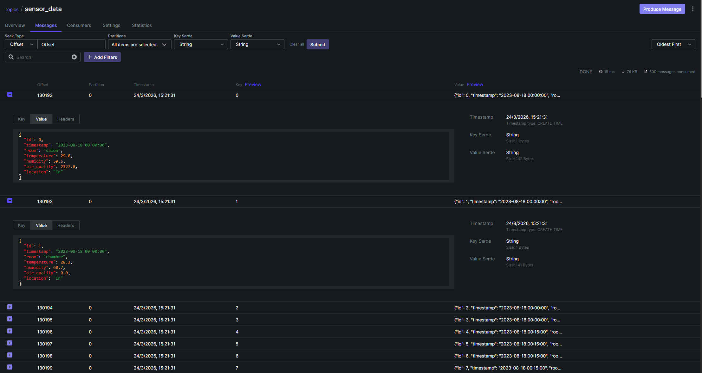

---

### CAPTURA 7 – Estado del conector HDFS en Kafka Connect

La respuesta JSON del endpoint `localhost:8083/connectors/hdfs-sink-sensor-data/status` confirma que el conector está operativo. El campo `connector.state` vale **RUNNING** con worker `kafka-connect:8083`, y la única tarea (`tasks[0]`) también está en estado **RUNNING** en el mismo worker. El tipo de conector es `sink`, lo que refleja su rol de consumidor de Kafka hacia HDFS.

```json
{"name":"hdfs-sink-sensor-data","connector":{"state":"RUNNING","worker_id":"kafka-connect:8083"},
 "tasks":[{"id":0,"state":"RUNNING","worker_id":"kafka-connect:8083"}],"type":"sink"}
```

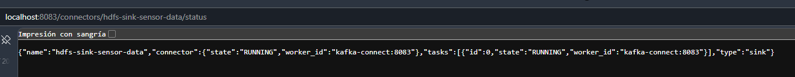

---

### CAPTURA 8 – Estructura de archivos en HDFS (NameNode Web UI)

El explorador de ficheros del NameNode (`Browse Directory`) muestra el contenido del directorio `/topics/sensor_data/partition=0/`. Se listan múltiples archivos JSON con nombres del patrón `sensor_data+0+<first_offset>+<last_offset>.json`. Cada archivo pesa entre 69 y 75 KB, tiene replicación 1 y block size de 128 MB. Todos fueron creados el 24 de marzo a las 11:50, propietario `apprvm`. El conector generó **231 archivos** en total al agrupar los 32.548 mensajes en bloques de 500.

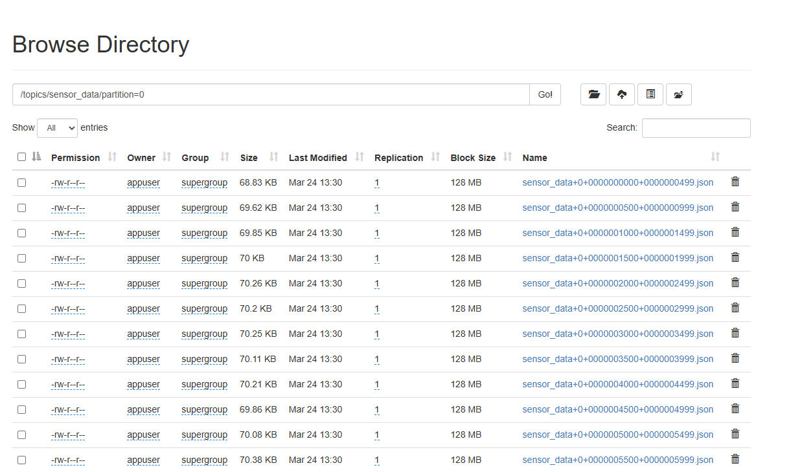

---

### CAPTURA 9 – Consulta sobre la tabla `sensor_readings` en PostgreSQL

Terminal PowerShell ejecutando el comando `docker exec -it postgres psql` con una consulta de agrupación por sala. El resultado confirma que las **4 salas tienen exactamente 8.137 lecturas cada una** y que las temperaturas medias son: `chambre` 25,49°C, `bureau` 23,44°C, `salon` 22,73°C y `exterieur` 16,67°C. La respuesta `(4 rows)` valida que los 32.548 registros están correctamente distribuidos en la tabla `sensor_data.sensor_readings`.


---

### CAPTURA 10 – Resultado de la consulta analítica Q1 en PostgreSQL

La misma consulta ejecutada de forma directa contra `sensor_data.sensor_readings` devuelve los valores analíticos finales agrupados por sala: temperatura media de **25,49°C** para `chambre`, **23,44°C** para `bureau`, **22,73°C** para `salon` y **16,67°C** para `exterieur`, con 8.137 registros exactos por sala. Estos valores coinciden con los publicados en el fichero `analytics_results.json` por la tarea `save_results`.

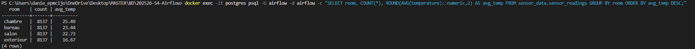

---

### CAPTURA 11 – Log de la tarea `verify_hdfs_files`

La vista de logs de la tarea `verify_hdfs_files` (run del 2026-03-24 a las 14:21:27 UTC) lista uno por uno los archivos presentes en HDFS junto con su tamaño en bytes. Se pueden ver nombres de archivo del tipo `sensor_data+0+0000013144+0000110163.json` con tamaños en torno a los 72.000 B. Al final del log aparece la línea `INFO – Done. Returned value was: None` y el enlace a los *Post task execution logs*, confirmando que la tarea finalizó con éxito tras verificar los **231 archivos** en HDFS.

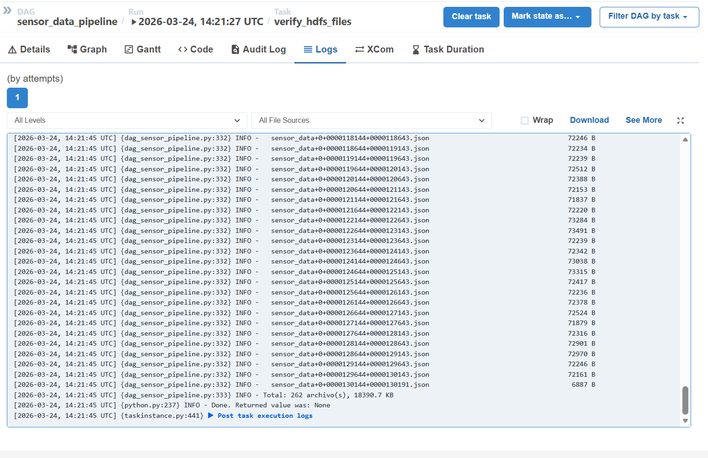

---

## 4. Análisis de resultados, dificultades y soluciones

### 4.1 Resultados del pipeline

La ejecución del DAG completó todas las etapas sin errores. Los datos de los 4 sensores domésticos fueron procesados de extremo a extremo:

| Métrica | Valor |
|---------|-------|
| Timestamps en el CSV | 8.137 |
| Mensajes publicados en Kafka | 32.548 |
| Archivos creados en HDFS | 231 |
| Registros transformados | 32.548 |
| Filas cargadas en PostgreSQL | 32.548 |
| Periodo cubierto | 2023-08-18 → 2023-11-10 |

### 4.2 Resultados analíticos

**Q1 – Temperatura y humedad media por sala:**

| Sala | Tipo | Temp. media (°C) | Humedad media (%) |
|------|------|-----------------|------------------|
| chambre | Interior | 25,49 | 47,93 |
| bureau | Interior | 23,44 | 51,69 |
| salon | Interior | 22,73 | 54,64 |
| exterieur | Exterior | 16,67 | 74,16 |

La *chambre* es la sala más cálida de forma consistente, posiblemente por orientación solar o menor ventilación. El exterior registra una humedad media muy elevada (74,16%), esperable en condiciones otoñales.

**Q2 – Rango diario de temperatura (Top días):**

Los 20 días con mayor variación diaria de temperatura corresponden todos a la sala exterior (`exterieur`), con rangos de hasta **17,97°C** (11 de octubre de 2023). Este patrón es indicativo de días con fuerte insolación diurna seguidos de noches frías (transición verano-otoño).

**Q3 – Lecturas con humedad crítica (>75%):**

Solo el sensor exterior supera el umbral del 75%, con **4.636 lecturas** (el 57% de sus 8.137 mediciones) y un pico de **100%** de humedad. Las salas interiores mantienen niveles confortables en todo el periodo, lo que indica una buena ventilación y control térmico en el interior.

**Q4 – Patrón horario temperatura interior vs exterior:**

La temperatura interior se mantiene muy estable a lo largo del día (23,2–24,4°C), mientras que la exterior sigue un ciclo marcado: mínimo en torno a las **8h** (12,6°C) y máximo a las **18h** (21,7°C). La diferencia máxima interior-exterior es de **~11°C**, lo que refleja la eficiencia del aislamiento de la vivienda.

**Q5 – Resumen ejecutivo:**

| Indicador | Valor |
|-----------|-------|
| Total de lecturas | 32.548 |
| Salas monitorizadas | 4 |
| Temperatura media global | 22,08°C |
| Desviación estándar temp. | 5,39°C |
| Humedad media global | 57,10% |
| Calidad del aire máx. | 2.486 ppm |
| % lecturas interiores | 75% |
| % lecturas exteriores | 25% |

### 4.3 Dificultades encontradas y soluciones

#### Dificultad 1: `consumer.auto.offset.reset` – mensajes previos al conector

**Problema:** el DAG primero publica todos los mensajes en Kafka (tarea 2) y después registra el conector HDFS (tarea 3). Por defecto, Kafka Connect comienza a consumir desde el *latest offset*, por lo que el conector ignoraba todos los mensajes ya publicados y no escribía nada en HDFS.

**Solución:** añadir `"consumer.auto.offset.reset": "earliest"` en la configuración del conector. Con esto, el conector arranca siempre desde el offset 0 del topic y consume todos los mensajes, independientemente de cuándo se haya registrado.

---

#### Dificultad 2: race condition entre Kafka Connect y el sensor HDFS

**Problema:** Kafka Connect necesita tiempo para arrancar y comenzar a escribir en HDFS. Si la tarea `wait_hdfs_flush` comprobaba HDFS demasiado pronto, el directorio no existía aún y la petición WebHDFS devolvía HTTP 404.

**Solución:** implementar el sensor como `PythonSensor` con `poke_interval=30s` y `timeout=600s` (10 minutos), capturando las excepciones de conexión. El sensor solo devuelve `True` cuando encuentra al menos un archivo con tamaño > 0, distinguiendo el directorio vacío o inexistente de la condición de éxito.

---

#### Dificultad 3: compatibilidad de versiones HDFS Connector

**Problema:** el conector oficial `confluentinc/kafka-connect-hdfs` (v5) usa la API de Hadoop 2.x y no es compatible con Apache Hadoop 3.4.x, generando errores de clase no encontrada al intentar conectar con el NameNode.

**Solución:** usar el conector `confluentinc/kafka-connect-hdfs:10.0.0` (HDFS3 Sink Connector), que está construido sobre la API de Hadoop 3.x. Se añade en `Dockerfile.kafka-connect` mediante `confluent-hub install --no-prompt confluent/kafka-connect-hdfs3:10.0.0`.

---

#### Dificultad 4: lectura de HDFS desde Airflow sin librerías Java

**Problema:** las librerías Python para HDFS (`hdfs`, `pyarrow`) requieren una instalación de Java o un cliente Hadoop compatible, lo que complica el `Dockerfile.airflow` y puede generar conflictos de versiones.

**Solución:** utilizar directamente la **API REST WebHDFS** (HTTP), que Hadoop expone en el puerto 9870. Todas las operaciones de listado (`op=LISTSTATUS`) y lectura de archivos (`op=OPEN`) se realizan con `requests.get()`, sin necesidad de instalar ninguna librería adicional más allá de `requests`.

---

#### Dificultad 5: Airflow no detectaba el DAG al arrancar

**Problema:** en las primeras pruebas, la UI de Airflow no mostraba el DAG `sensor_data_pipeline`, indicando un error de importación.

**Solución:** la causa era una dependencia circular en las importaciones del módulo. Se reorganizó el DAG para que todas las constantes y funciones se definieran antes de los objetos `Task`, y se verificó que el volumen `./src:/opt/airflow/dags` estaba correctamente montado en el `docker-compose.yml`. Con `docker exec airflow airflow dags list` se confirmó que el DAG se reconocía antes de lanzar la ejecución.

---

*Fin de la memoria técnica.*